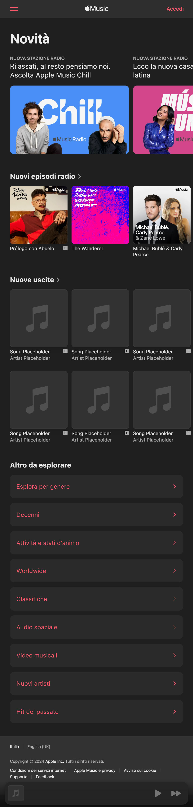
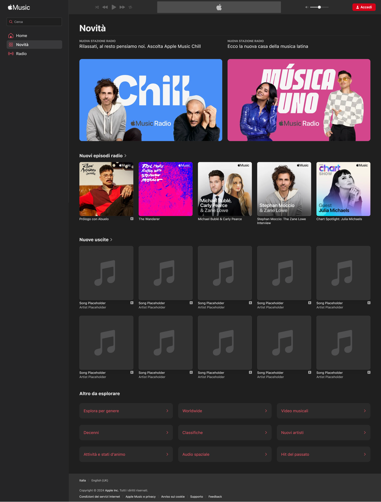

  

---

## ⚠️ Disclaimer

**THIS PAGE WAS MADE AS A PERSONAL EDUCATIONAL PROJECT.**  
This is **NOT** the official site of the company or brand identified on the page.  
The creator of this page is **NOT affiliated** with the company or brand in any way.  
This page is a personal project made in connection with an educational exercise.

---

## 📦 Consegna

  

---

## ⚠️ Disclaimer

**THIS PAGE WAS MADE AS A PERSONAL EDUCATIONAL PROJECT.**  
This is **NOT** the official site of the company or brand identified on the page.  
The creator of this page is **NOT affiliated** with the company or brand in any way.  
This page is a personal project made in connection with an educational exercise.

---

## 📦 Consegna

Crea un nuovo progetto tramite Vite.

Installa il framework CSS che preferisci ed eventuali pacchetti extra se lo desideri (l'app possiederà solamente la schermata principale, react-router-dom non sarà necessario).

Ricrea la schermata di Apple Music utilizzando una struttura a righe e colonne, integrando gli assets forniti. Ti consigliamo come sempre di partire dalla versione mobile. Non cercare subito la perfezione, ma cerca all'inizio di imbastire l'impaginazione in modo sommario in modo da riuscire ad ospitare le varie sezioni.

Cerca di creare componenti riutilizzabili, in modo da scrivere una volta sola le card musicali, le sezioni, le voci del menu, etc.

Utilizza le API di Deezer per ottenere dei contenuti a tua scelta e ricreare la sezione "Nuove uscite".

[EXTRA] Implementa Redux come visto a lezione per creare uno store a livello applicativo. Lo puoi utilizzare per salvare informazioni come i brani preferiti, o per popolare la sezione del player con le informazioni della traccia appena cliccata.

[EXTRA] In alternativa, se la ritieni una sfida alla tua portata, puoi valutare di scrivere l'intera applicazione utilizzando TypeScript.

---

## 📺 Mockups

---

